# Metal Realtime PBR Path Tracer + Neural Ray Amplification

A from-scratch, **hardware‑accelerated path tracer written entirely on Apple Metal**,
with a physically based (PBR) shading model in the style of PBRT / OpenMoonRay — plus
a research probe into a concrete hypothesis:

> **Can an inference model predict the additional samples around a single cast ray —
> so we physically trace *one* ray per pixel but obtain the radiance of *many*?**

Short answer from this repo: **yes, ~68×** on a held‑out view of the Cornell box (directly
measured against the real Monte‑Carlo convergence curve, no `1/√N` assumption), turning a
13.4 dB single‑sample image into a 28.1 dB one.

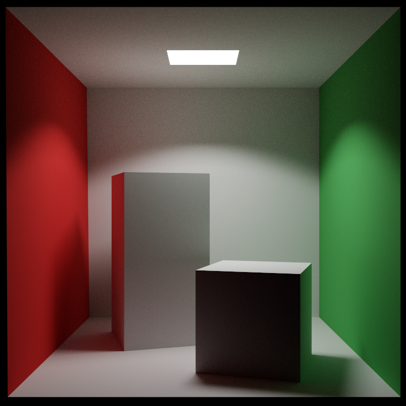

*800×800, 1024 spp, hardware ray tracing on an Apple M4 (5.6 s): global illumination,
color bleeding, soft shadows.*

| 1 spp (one cast ray) | neural amplifier (one cast ray + inference) | 512 spp reference |
|:--:|:--:|:--:|
| 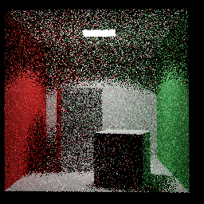 | 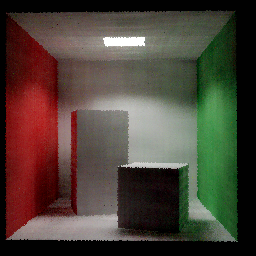 | 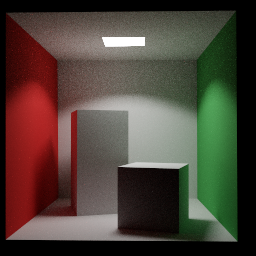 |

*(See `research/results/comparison.png` and `research/results/convergence.png`.)*

---

## 1. What it is

* A **unidirectional path tracer** *and* a full **bidirectional path tracer (BDPT)** running
  on Metal compute with **hardware ray tracing** (`MTLAccelerationStructure`,
  `metal_raytracing` intersectors). BDPT builds camera + light subpaths and connects them
  with PBRT‑style multiple‑importance‑sampling over every strategy (validated to agree with
  the unidirectional estimator).
* **Full PBR**: GGX/Trowbridge‑Reitz microfacet specular, metallic‑roughness workflow,
  Fresnel‑Schlick, height‑correlated Smith masking, Lambert diffuse, VNDF importance
  sampling (Heitz 2018), **next‑event estimation + multiple importance sampling** (power
  heuristic), Russian‑roulette termination, thin‑lens depth of field, ACES tonemapping.
* **Hardware instancing.** A two‑level acceleration structure (BLAS‑per‑mesh + a top‑level
  `MTLInstanceAccelerationStructure`) replicates a handful of unique meshes across many
  instances with a tiny memory footprint — the same engine that loads Crytek Sponza as
  per‑material instances and that the synthetic `insttest` scene stresses.
* **Real textured scenes.** A UV‑preserving **OBJ + MTL loader** (`OBJScene.swift`) with an
  ImageIO **texture pipeline** (sRGB `MTLTexture` + mips, 32‑slot sampler array) renders the
  canonical **Crytek Sponza** GI scene — 262 k triangles, 25 materials, 43 textures — fully lit.
* **Realtime**: progressive accumulation; ~**2 ms/frame at 1 spp** (400×400, Apple M4),
  i.e. it refines while idle and stays interactive while you move.
* **No Xcode required.** The Metal shaders are **compiled at runtime** from source
  (`MTLDevice.makeLibrary(source:)`), so the whole thing builds and runs with only the
  Swift toolchain in the **Command Line Tools**.
* A **neural ray‑amplifier** research pipeline (Metal data export → PyTorch model →
  rigorous effective‑sample measurement).

## 2. Requirements

* macOS on **Apple Silicon** (tested: M4, macOS 15) — needs `MTLDevice.supportsRaytracing`.
* **Swift toolchain** (Command Line Tools: `xcode-select --install`). Full Xcode not needed.
* For the research part: **Python 3.9+** with `torch`, `numpy`, `matplotlib`, `pillow`.

## 3. Build & run

```bash
swift build -c release

# Cornell box, 512 spp, with light radiance clamping, → render.png
./.build/release/pathtracer --scene cornell --width 800 --height 800 --spp 512 --clamp 8 --out cornell.png

# PBR material showcase (metallic / roughness sweeps under an area light + sky)
./.build/release/pathtracer --scene showcase --width 900 --height 640 --spp 512 --clamp 10 --out showcase.png

# Geometry/normal debug view (1 spp)
./.build/release/pathtracer --scene cornell --kernel normals --out normals.png

# Load a real OBJ test model into the Cornell box (porcelain · gold · copper · jade · mirror · red · white)
./.build/release/pathtracer --model assets/stanford-bunny.obj --modelMat porcelain --yaw 180 --spp 256 --out bunny.png
./.build/release/pathtracer --model assets/xyzrgb_dragon.obj  --modelMat gold --yaw 215 --fit 360 --spp 256 --out dragon.png

# Crytek Sponza — the canonical GI scene, full textures + materials (auto-framed colonnade)
research/download_sponza.sh                     # obj + mtl + 43 textures → assets/sponza
./.build/release/pathtracer --scene sponza --width 1600 --height 900 --spp 384 --clamp 8 --out sponza.png

# Bidirectional path tracing (camera + light subpaths, MIS over all strategies)
./.build/release/pathtracer --scene cornell --integrator bdpt --width 800 --height 800 --spp 256 --out cornell_bdpt.png

# Hardware-instancing sanity scene (two-level BLAS/TLAS, instanced cubes under sun + sky)
./.build/release/pathtracer --scene insttest --width 1000 --height 640 --spp 128 --out insttest.png

# Realtime interactive viewer with live feature (AOV) toggles — works with sponza too
./.build/release/pathtracer --window --scene sponza --width 1000 --height 640
```

CLI flags: `--scene {cornell|showcase|insttest|sponza}` · `--integrator {pt|bdpt}`
· `--model <file.obj>` · `--modelMat <preset>` · `--yaw <deg>` · `--fit <units>`
· `--obj <file.obj>` · `--extent <units>` (sponza/objscene)
· `--width/--height` · `--spp` · `--bounces` · `--clamp <luminance>` (0 = unbiased)
· `--exposure` · `--view {0..7}` (instanced AOV) / `{0..9}` (Cornell ML‑feature channel) · `--notex` · `--kernel {pathtrace|normals}` · `--window` · `--out`.

## 4. Real test scenes (OBJ models)

A fast, dependency-free Wavefront **OBJ loader** (`OBJLoader.swift`) streams real research
meshes straight onto the hardware BVH; `--model` fits the mesh onto the Cornell‑box floor
so it picks up classic color‑bleeding global illumination. Smooth normals are synthesized,
so models without normals shade cleanly.

| Stanford Bunny (porcelain) | XYZ RGB Dragon (gold) | Happy Buddha (copper) |
|:--:|:--:|:--:|
| 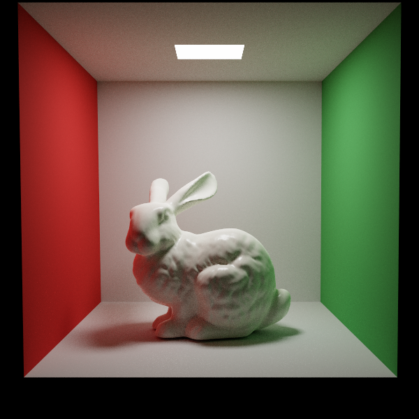 | 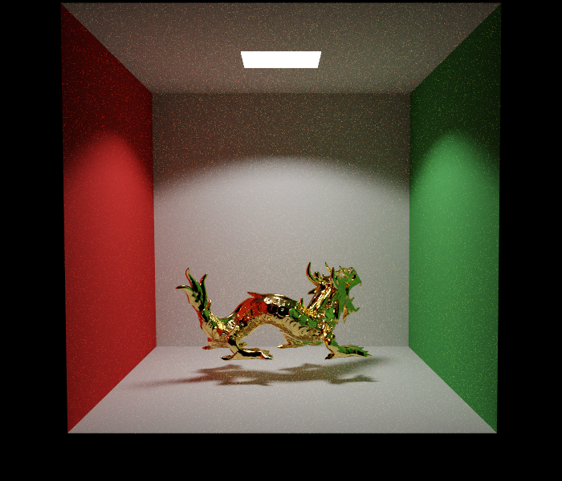 | 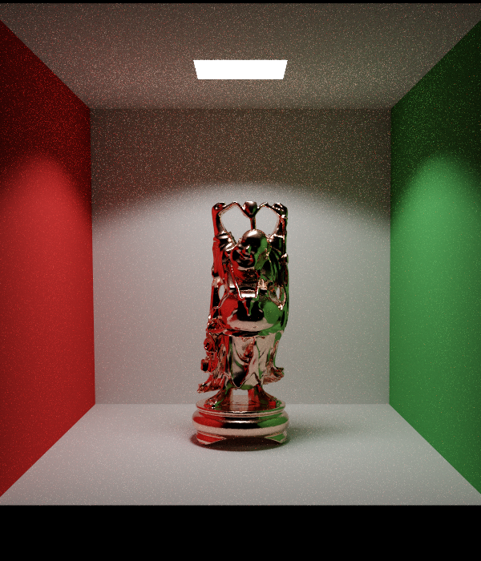 |
| 69 k tris · GI bleed | 250 k tris · metal reflections | 99 k tris · metal reflections |

Grab classic models (CC/permissive, from the `common-3d-test-models` archive):

```bash
mkdir -p assets
for m in stanford-bunny xyzrgb_dragon happy spot teapot armadillo lucy; do
  curl -fsSL "https://raw.githubusercontent.com/alecjacobson/common-3d-test-models/master/data/$m.obj" -o "assets/$m.obj"
done
```

### Crytek *Sponza* — the canonical GI scene, with full materials & textures

[Sponza](https://www.cryengine.com/marketplace/sponza-sample-scene) (Frank Meinl / Crytek)
is *the* reference scene for global illumination — an open arcade where skylight bounces deep
into a textured stone colonnade. This renderer loads the real **262 k‑triangle** OBJ with its
**25 materials** and **43 textures**, mapped per‑UV onto the hardware BVH:

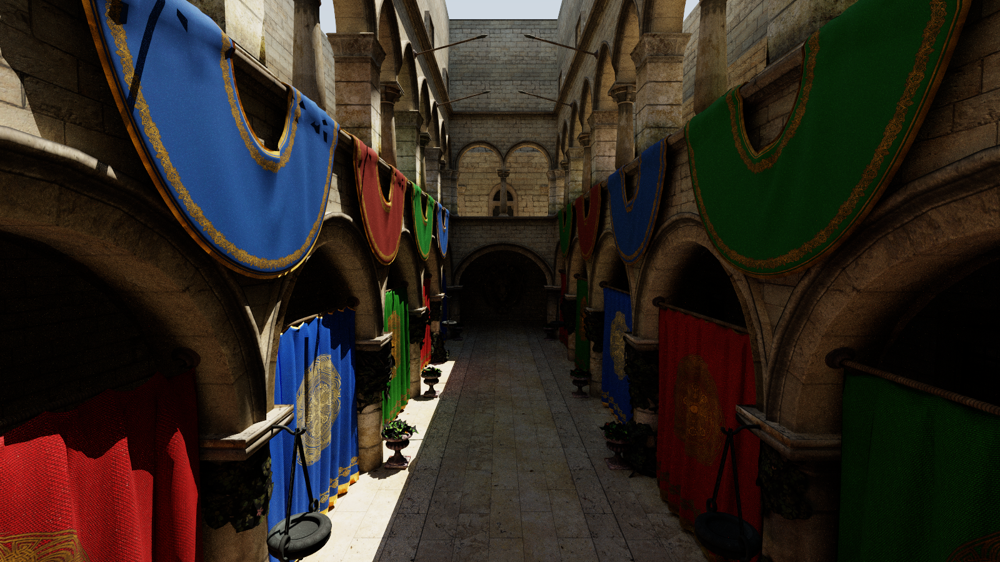

*1600×900, 384 spp — the iconic colonnade. Every surface is a sampled `.tga`: brick columns,
the tiled marble floor, hanging plants, and the blue/red/green banners with gold filigree.
Sky‑dome + sun global illumination floods the arcade, with soft contact shadows and
colour bleed off the drapes — auto‑framed by `--scene sponza`, no flags needed.*

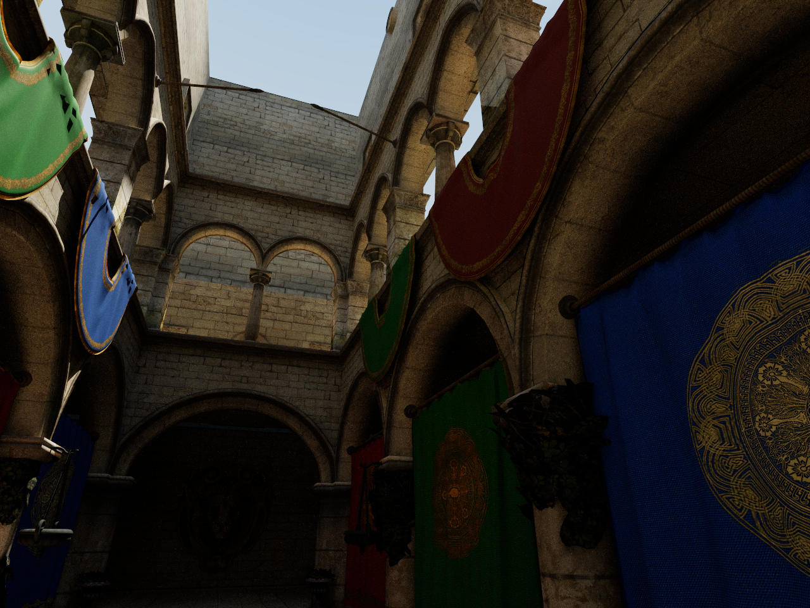

*1280×960, 384 spp — a second angle up into the gallery: arches, the upper‑floor windows and
banners against the open sky.*

A subtlety that makes Sponza a good "materials working" proof: **all 25 materials share the
same gray diffuse** (`Kd ≈ 0.47`) — *every* bit of colour and detail lives in the `map_Kd`
textures, so the picture is entirely carried by the texture pipeline (`TextureLoader.swift`
→ sRGB `MTLTexture` + mips → a 32‑slot sampler array in the shared instanced kernel). The
loader (`OBJScene.swift`) is UV‑preserving, splits the OBJ into per‑material instances, and
skips the full‑footprint roof cap so the sky dome can light the interior (the integrator uses
sun + sky, no area lights). Fetch and render:

```bash
research/download_sponza.sh                       # obj + mtl + 43 textures (~180 MB)
./.build/release/pathtracer --scene sponza --width 1600 --height 900 --spp 384 --out sponza.png
```

Env toggles: `SPONZA_CAM="ex,ey,ez,tx,ty,tz"` (custom camera, native coords) ·
`SPONZA_NOTEX=1` (flat gray, textures off) · `SPONZA_KEEPROOF=1` (keep the roof) ·
`SPONZA_DBG=1` (print atrium‑core bounds). `--obj <file.obj>` + `--extent <units>` render any
other textured OBJ/MTL scene through the same path.

#### Interactive viewer with live feature (AOV) toggles

`--window` opens a progressive, real‑time path‑traced viewer that re‑accumulates samples every
frame and resets cleanly whenever the image changes (camera, view mode, textures, bounces,
exposure). It works for any instanced scene — `sponza`, `insttest`, or any `--obj` — not just Cornell:

```bash
./.build/release/pathtracer --window --scene sponza --width 1000 --height 640 --bounces 4
```

The viewer can decompose the frame into eight **arbitrary output variables (AOVs)** live, so you
can *see the renderer working* — geometry, materials, UVs and lighting terms in isolation:

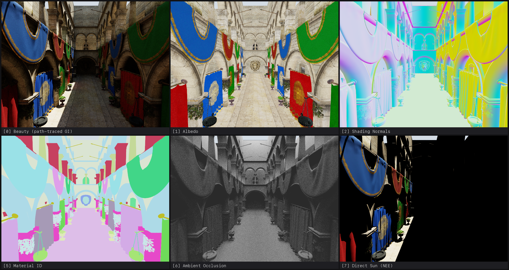

| key | controls |
|:--|:--|
| **arrows** | orbit · **W/S** zoom · **A/D/Q/E** pan · **R** reset camera · **Esc** quit |
| **0–7** | select an AOV directly · **M/N** cycle forward / back |
| **T** | textures on/off · **`[` / `]`** fewer / more bounces · **`-` / `=`** exposure down / up |

The AOVs are `0` Beauty · `1` Albedo · `2` Shading Normals · `3` Geo Normals · `4` UVs ·
`5` Material ID · `6` Ambient Occlusion · `7` Direct Light. The same modes render to disk
head‑less with `--view {0..7}` (and `--notex` forces flat‑gray albedo), so AOVs double as a
debugging and figure‑making tool. The window title bar shows the live mode, texture state,
bounce count, exposure and accumulated spp.

#### ML‑pipeline diagnostics — *see what the neural amplifier sees*

For the **Cornell / showcase** scenes (the classic `Renderer`, the one the neural
ray‑amplifier trains on, §5) the same viewer decomposes the frame into the exact channels of
the **21‑dim feature vector** the network ingests (`exportFeatures` → `research/model.py`), so
you can inspect the model's inputs live for any camera and flip between the cheap input and the
converging reference:

| key | channel | what the model sees |
|:--|:--|:--|
| **0** | Beauty | the converging path‑traced reference (the regression *target*) |
| **1** | 1‑spp Radiance | the single physically cast ray — the cheap, noisy signal to amplify |
| **2** | Shading Normal | first‑hit shading normal |
| **3** | View Dir | view direction `wo` |
| **4** | Base Color | albedo |
| **5** / **6** | Metallic / Roughness | the PBR material inputs |
| **7** | Norm. Position | scene‑normalized hit position — *exactly* the network's position input |
| **8** | Bounce Dir | the sampled first‑bounce direction |
| **9** | Hit Mask | primary‑ray coverage (which pixels are valid training samples) |

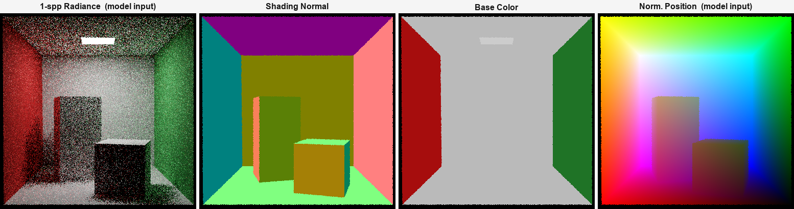

The title bar adds a live **ML‑input readout** — hit coverage %, the mean 1‑spp luminance the
amplifier must turn into converged radiance, and the mean roughness / metallic it conditions on —
recomputed whenever the camera moves. As with the Sponza AOVs these channels also render to disk
head‑less with `--view {1..9}` (e.g. `--scene cornell --view 1 --out one_spp.png`), so the
amplifier's inputs double as figures and sanity checks. Flipping **0 ↔ 1** is the hypothesis in
one keystroke: the converged target vs. the single ray it is reconstructed from.

```bash
# open the viewer straight onto the 1-spp signal the amplifier learns to denoise
./.build/release/pathtracer --window --scene cornell --view 1
```

#### Alpha‑tested foliage (leaf / vine / thorn cutouts)

Sponza's plants, hanging chains and thorny vines are modeled as flat quads whose silhouette
lives in a **cutout mask**. The renderer alpha‑tests every hit: it samples the albedo texture's
alpha at the hit UV and, if it is below 0.5, treats the hit as a miss and re‑intersects past it
(both for primary/secondary rays and for shadow rays). The cutout masks ship **inside the diffuse
TGA's own alpha channel** (`vase_plant`, `chain_texture`, `sponza_thorn_diff`), so no extra
`map_d` pass is needed; opaque 3‑channel textures simply read alpha = 1 and are never cut.

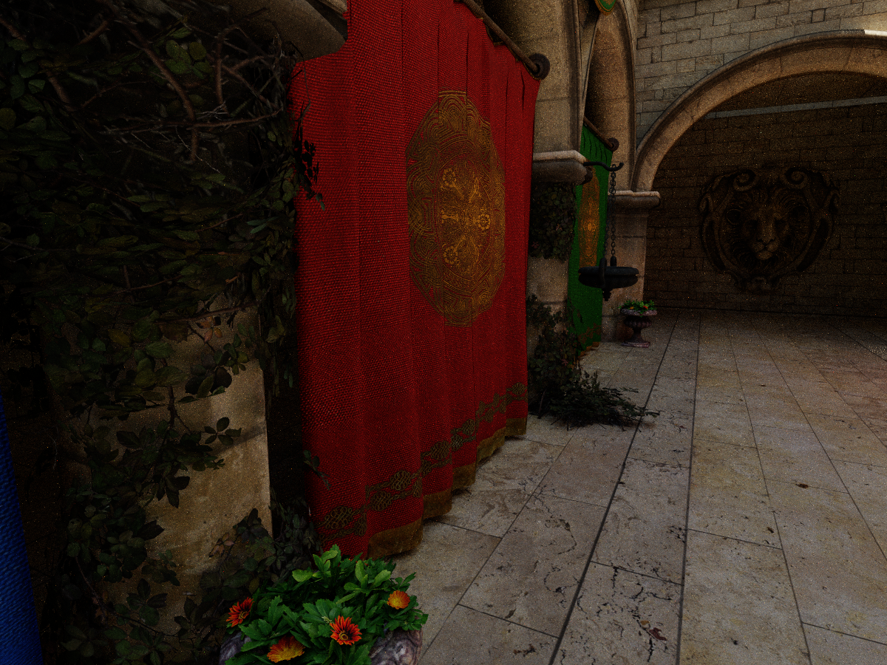

*Tight crop on an atrium plant: crisp per‑leaf silhouettes with the background visible through
the gaps — not solid quads. `SPONZA_CAM="-150,150,70,-407,100,197"` frames this cluster.*

## 5. Architecture

```
Sources/PathTracer/
  Resources/pathtrace.metal   MSL kernels: HW‑RT PT + BDPT integrators, NEE+MIS, instanced
                              (BLAS/TLAS) integrator, normals, feature export, resolve
  Renderer.swift              Metal device, scene buffers, accel build, pipelines, accumulation
  Scene.swift                 Cornell box + PBR material‑showcase scenes, geometry builders
  Instancing.swift            BLAS‑per‑mesh + top‑level instance accel structure, instanced renderer
  OBJScene.swift              UV‑preserving OBJ+MTL loader → per‑material instances (Sponza)
  TextureLoader.swift         ImageIO → sRGB MTLTexture + mips for the 32‑slot sampler array
  OBJLoader.swift             fast Wavefront OBJ loader (multi‑million‑triangle meshes)
  MathTypes.swift             host mirrors of the GPU structs, camera, tonemapping
  WindowApp.swift             realtime MTKView app + orbit camera
  DataExport.swift            multi‑view training‑data export (research)
  SampleStack.swift           held‑out Monte‑Carlo stack for effective‑spp measurement
  Util.swift / PNGWriter.swift  deterministic RNG, camera (de)serialization, PNG output
research/
  model.py  train.py  eval_amplify.py   neural amplifier: model, training, measurement
  download_sponza.sh                                Crytek Sponza: obj + mtl + textures fetch
```

Data flow each frame: `pathtrace` kernel casts camera rays → traverses the acceleration
structure → evaluates the PBR BSDF with NEE+MIS → adds the sample into a `float4`
accumulation buffer; `resolve` tonemaps `accum/​sampleCount` into the drawable (realtime)
or the CPU tonemaps it to a PNG (headless).

## 5. The research hypothesis

**Framing.** Path tracing is expensive because each pixel needs *many* sample paths to
beat Monte‑Carlo noise. The hypothesis asks whether a learned model can supply the
*rest of the samples* from a single physically cast ray. We implement this as a per‑scene
**neural radiance amplifier** (in the spirit of Müller et al., *Real‑time Neural Radiance
Caching for Path Tracing*, 2021): for every pixel the Metal tracer exports the **one cast
ray’s** first‑hit G‑buffer (position, normal, view & bounce directions, base color,
metallic, roughness) **plus that single ray’s 1‑spp radiance**, and a small MLP
(288 k params) regresses the **converged multi‑sample radiance**. It is trained on a set
of camera views and evaluated on **held‑out** views it never saw.

**Result (held‑out Cornell views).**

| metric (shaded pixels) | 1 spp (one cast ray) | neural (one cast ray + inference) |
|---|--:|--:|
| relative MSE            | 0.710 | **0.0102** |
| tonemapped PSNR         | 13.4 dB | **28.1 dB** (+14.6 dB) |

**Directly measured effective samples.** Rather than assume `error ∝ 1/√N`, we render the
held‑out view as **256 independent 1‑spp images** and average prefixes to obtain the *true*
path‑tracing convergence curve `relMSE(K)`, then find where it crosses the neural error:

```
1 spp path tracing    relMSE = 0.687
256 spp path tracing  relMSE = 0.0031
neural (1 cast ray)   relMSE = 0.0111   →  ≈ 67.6 path‑traced samples
```

So **one physically cast ray + inference ≈ 68 path‑traced samples** on this unseen view
(`research/results/convergence.png`). The measured MC curve is a textbook straight `1/N`
line in log–log, which independently validates the tracer’s estimator.

**Reproduce:**

```bash
# 1) export a multi‑view dataset (1‑spp features + high‑spp targets) from the tracer
./.build/release/pathtracer --export --scene cornell --width 256 --height 256 \
      --views 16 --targetSpp 512 --bounces 6 --clamp 8 --out research/data

# 2) train + evaluate the amplifier on held‑out views (saves comparison.png, model.pt)
cd research && python3 train.py --data data --out results --epochs 60

# 3) rigorous effective‑sample measurement on a held‑out view (saves convergence.png)
cd .. && ./.build/release/pathtracer --samplestack --scene cornell --view 15 \
      --width 160 --height 160 --stackM 256 --refSpp 2048 --data research/data --out research/stack
cd research && python3 eval_amplify.py --stack ../research/stack --model results --out results
```

See **`research/REPORT.md`** for the full experiment write‑up, metrics, and honest caveats.

### Honest framing / limitations

* The amplifier predicts the **integrated radiance** that additional samples would carry
  (sample amplification / learned cache), conditioned on the single cast ray’s path
  direction and its 1‑spp radiance — it does **not** synthesize literal extra geometric
  ray paths. Predicting integrated radiance is the tractable, standard interpretation and
  is what makes the “one ray → many samples” trade quantifiable.
* Generalization is demonstrated **across camera views of the same scene** (held out), the
  same online/per‑scene regime as Neural Radiance Caching — **not** across scenes.
* Inference currently runs in PyTorch for analysis; folding the MLP into the Metal render
  loop (via MPSGraph/Core ML) for end‑to‑end realtime amplification is future work.

## 6. References

* M. Pharr, W. Jakob, G. Humphreys — *Physically Based Rendering* (path‑tracing integrator, MIS, BDPT).
* T. Müller et al. — *Real‑time Neural Radiance Caching for Path Tracing*, SIGGRAPH 2021.
* E. Heitz — *Sampling the GGX Distribution of Visible Normals*, JCGT 2018.
* E. Veach — *Robust Monte Carlo Methods for Light Transport Simulation* (BDPT, MIS), 1997.
* Cornell Box reference geometry (Cornell Program of Computer Graphics).
* Apple — *Metal*, *Accelerating ray tracing using Metal* (instance acceleration structures).
