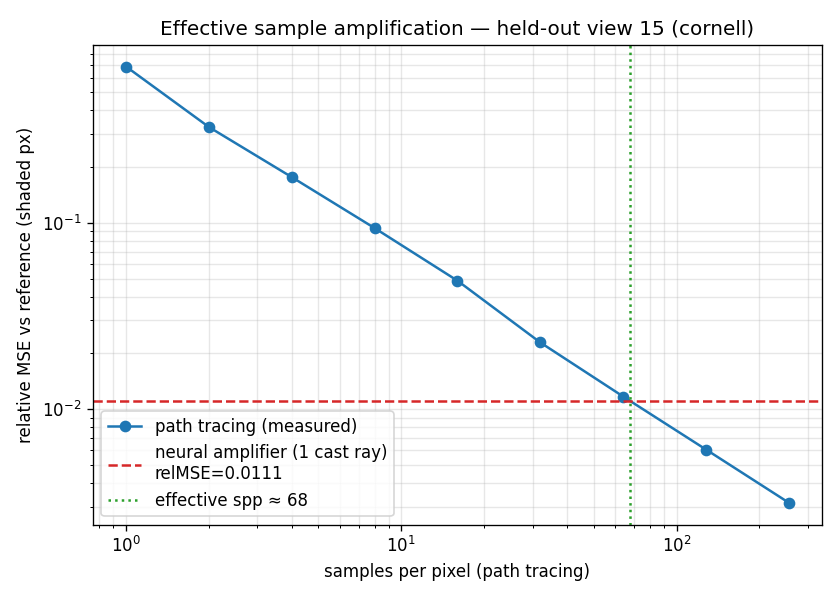

# Neural Ray Amplification — Experiment Report

**Question.** Can an inference model predict the additional samples around a single
physically cast ray, so that path tracing casts **one** ray per pixel but obtains the
radiance of **many**?

**Answer (this experiment).** Yes, as a *per‑scene learned radiance amplifier*. On a
held‑out view of the Cornell box, a 288 k‑parameter MLP fed a single cast ray’s features
matches the quality of **≈ 68 path‑traced samples per pixel** (directly measured), lifting
the image from **13.4 dB to 28.1 dB** PSNR.

---

## 1. Method

The Metal path tracer (`pathtrace.metal`) is an unidirectional integrator with
GGX microfacet PBR, next‑event estimation and multiple importance sampling — i.e. a
correct, unbiased Monte‑Carlo estimator (verified: its measured convergence is a clean
`1/N` line, §3).

For each pixel we **cast exactly one ray** and export (`exportFeatures` kernel):

| group | features |
|---|---|
| geometry (G‑buffer) | first‑hit position (scene‑normalized), shading normal, view dir |
| material            | base color, metallic, roughness |
| the one cast ray    | first bounce direction, **and that single path’s 1‑spp radiance** |

A small MLP regresses the **converged (high‑spp) radiance**:

* radiance is handled in `log1p` space (HDR‑aware), and the network predicts a **residual
  over the single sample’s log‑radiance** (so it starts from the cheap signal and denoises);
* geometric inputs (position + bounce direction) get a 6‑band Fourier encoding;
* loss = log‑space MSE + a relative‑L2 term (the relative loss used by Neural Radiance
  Caching); Adam, cosine LR, 60 epochs, ~100 s on the M4 (MPS).

Training views and evaluation views are **disjoint cameras** of the same scene — the model
is scored only on viewpoints it never saw, the same online/per‑scene regime as NRC.

Dataset for the numbers below: Cornell box, 16 views (14 train / 2 held‑out), 256×256,
512‑spp targets, 6 bounces, radiance‑clamp 8.

## 2. Image‑quality results (held‑out views)

| metric (shaded pixels) | 1 spp | neural | improvement |
|---|--:|--:|--:|
| relative MSE          | 0.710  | **0.0102** | **69× lower** |
| tonemapped PSNR       | 13.4 dB | **28.1 dB** | **+14.6 dB** |

`research/results/comparison.png` shows `[1 spp · neural · reference]` and the error maps:
the single‑sample image is pure noise, the neural image is visually indistinguishable from
the 512‑spp reference except for slight softening on the indirectly‑lit blocks.

## 3. Directly measured “effective samples” (no `1/√N` assumption)

To avoid leaning on the theoretical Monte‑Carlo error law, we **measure** it. For one
held‑out view the tracer (`--samplestack`) renders **256 independent 1‑spp images** plus an
independent **2048‑spp reference**. Averaging the first `K` images is exactly a `K`‑spp
estimate, so `relMSE(K)` vs the reference is the *true* convergence curve. We then find the
`K` whose error equals the neural amplifier’s:

```
K  =   1     2     4     8     16     32     64     128    256
rel= 0.687 0.326 0.176 0.094 0.049  0.023  0.012  0.0061 0.0031
neural (1 cast ray)  relMSE = 0.0111   →  crosses at  K ≈ 67.6
```



The path‑tracing points lie on a straight `1/N` log–log line (estimator sanity check), and
the neural amplifier from a single ray sits at the quality of **≈ 68 samples**.

## 4. Interpretation

* This is **sample amplification / a learned radiance cache**: the network predicts the
  *integrated radiance* that additional sibling samples would have produced, conditioned on
  the one cast ray’s direction and its noisy 1‑spp value. It does **not** synthesize literal
  extra geometric ray paths — predicting their integrated contribution is the tractable and
  measurable interpretation of “one ray → many samples”.
* The win is largest exactly where path tracing is weakest — noisy **indirect** illumination
  — because the network regresses the smooth converged mean instead of a high‑variance sample.

## 5. Limitations & threats to validity

* **Per‑scene, cross‑view.** Generalization is across unseen *cameras* of one scene, not
  across scenes (identical regime to NRC’s online cache). A model trained on Cornell will
  not transfer to an arbitrary new scene without (re)training.
* **Bias.** The amplifier is a biased estimator (a regressor); it trades Monte‑Carlo
  variance for learned bias. The “68×” is a quality‑equivalence, not an unbiased speedup.
* **Reference is finite** (512‑spp targets, 2048‑spp measurement reference). The measurement
  reference’s noise floor (relMSE ≈ 4e‑4 at 2048 spp) is well below the crossing (0.011), so
  it does not affect the result.
* **Inference cost not yet in‑loop.** Scoring runs in PyTorch for analysis. A fair end‑to‑end
  realtime speedup requires folding the MLP into the Metal frame (MPSGraph/Core ML) and
  amortizing it against the rays it replaces — future work.
* **Single scene/geometry.** Numbers are reported for the Cornell box; the showcase scene is
  provided for qualitative PBR validation but was not used in the quantitative study.

## 6. Reproduce

```bash
swift build -c release
./.build/release/pathtracer --export --scene cornell --width 256 --height 256 \
      --views 16 --targetSpp 512 --bounces 6 --clamp 8 --out research/data
cd research && python3 train.py --data data --out results --epochs 60
cd .. && ./.build/release/pathtracer --samplestack --scene cornell --view 15 \
      --width 160 --height 160 --stackM 256 --refSpp 2048 --data research/data --out research/stack
cd research && python3 eval_amplify.py --stack ../research/stack --model results --out results
```

Outputs: `results/metrics.json`, `results/comparison.png`, `results/amplify.json`,
`results/convergence.png`.
